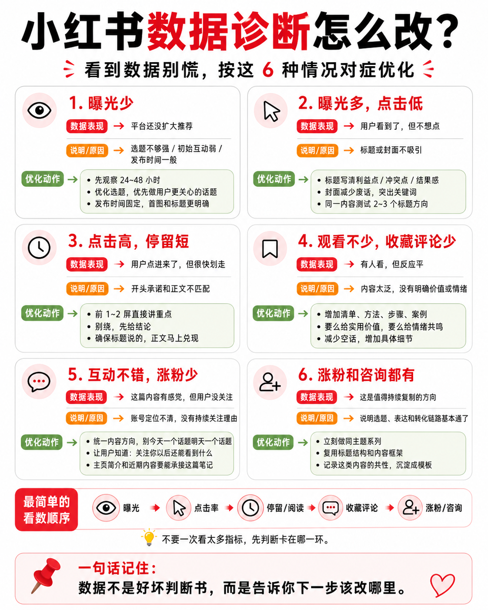

你这个问题问到了核心。

前面说“做AI自动化服务”，确实容易让你感觉：

> “那不还是卖我的时间和技术吗？和外包有什么区别？”

这个质疑是对的。

如果只是：

客户提需求 → 你开发 → 收钱

那本质还是外包。

你的目标不是回到外包模式。

所以要重新划分。

---

# 一、外包和你应该做的区别在哪里？

## 传统外包：

客户：

“我要一个系统。”

你：

写代码。

交付。

结束。

价值：

你的开发时间。

公式：

```
收入 = 时间 × 技术单价
```

天花板明显。

---

## 你应该做的：

不是卖开发。

而是卖：

> **某个业务结果的解决方案。**

区别：

客户不是找你：

“开发一个AI工具。”

而是：

“我想降低运营成本。”

“我想获得客户。”

“我想自动处理重复工作。”

---

你的技术只是实现手段。

---

# 二、结合你的能力，你真正适合的服务是什么？

你的优势不是普通开发。

你有：

- 浏览器自动化
    
- 插件开发
    
- AI调用
    
- 流程设计
    
- 电商/直播经验
    

所以你适合：

## 「AI业务自动化改造」

不是写软件。

而是：

帮一个具体业务，把人工流程变成自动流程。

---

举几个真实场景：

---

## 场景1：小红书/直播商家

他们的问题：

不是：

“我要一个插件。”

而是：

“每天运营太累。”

流程：

现在：

运营人员：

- 找素材
    
- 写标题
    
- 回复评论
    
- 整理客户
    
- 看数据
    

你帮他：

梳理流程。

然后：

AI + 自动化解决。

收费：

不是按代码。

按：

“帮你减少多少人工成本”。

---

## 场景2：淘宝商家

问题：

每天：

- 上架商品
    
- 修改标题
    
- 处理客服
    
- 分析竞品
    

你提供：

“AI运营助手方案”。

---

## 场景3：内容创业者

问题：

有流量，但是：

- 不知道选题
    
- 不会整理素材
    
- 不会复盘
    

你提供：

AI内容工作流。

---

# 三、但是你现在为什么会觉得空？

因为你还缺一个东西：

**行业入口。**

技术人员容易：

“我会什么？”

然后找需求。

商业应该：

“谁痛苦？”

然后解决。

---

你之前做小红书直播插件，其实已经有入口：

你不是没有行业。

你的行业：

> 内容、电商、直播、个人创业者。

---

# 四、那你现在应该怎么定位？

不是：

“软件开发接单。”

也不是：

“AI工具开发。”

而是：

## AI效率改造顾问（个人版）

一句话：

> 帮个人创业者和小商家，把重复运营工作用AI和自动化改造，提高效率。

---

你的交付方式：

第一步：

诊断。

例如：

“你的业务每天哪些事情重复？”

---

第二步：

设计流程。

例如：

人工：

5小时/天。

优化：

1小时/天。

---

第三步：

实现。

用：

- AI
    
- 插件
    
- 自动化
    
- SaaS工具
    

---

第四步：

长期维护。

---

# 五、这和你做产品有什么关系？

非常重要。

服务不是终点。

服务是市场调查。

比如：

你服务10个商家。

发现：

8个都有：

“小红书内容管理问题”。

那么：

你开发：

AI小红书运营工具。

这时候产品有人买。

---

所以路径：

不是：

开发产品 → 找客户

而是：

```
客户问题
↓
服务解决
↓
发现重复需求
↓
产品化
```

---

# 六、你现在最现实的切入点

结合你的经历，我觉得不要泛泛做“AI自动化”。

太大。

切：

## “AI帮助小红书/直播卖家提升运营效率”

因为你有：

- 小红书直播插件案例；
    
- 电商工具经验；
    
- 自动化能力。
    

你的第一批客户也更容易找到。

---

所以回答你的问题：

> 我的技术和时间，本质上和外包和打工有区别吗？

如果只是接需求开发：

没有区别。

如果你变成：

**发现行业重复问题 → 用技术形成标准解决方案 → 不断复制**

这才从外包走向创业。

你现在缺的不是技术，而是找到第一个“可复制的问题”。你前面研究小红书运营SOP，其实就是在补这个能力。
